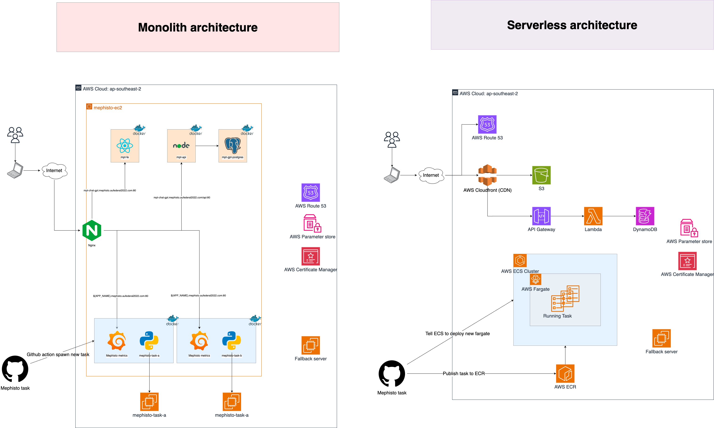

# mpt-gpt-serverless
node version >= 18.8.8

# How to run:
## set up aws credentials:
  - install aws-cli
  - Copy key id and secret key on aws
  - On ubuntu terminal:
    + sudo su
    + cd .aws
    + vim credentials
    + paste key to credentials file

## How to setup environment
 - npx sst secrets set GPT_URL {url}
 - npx sst secrets set GPT_TOKEN {token}

## How to run
  - npm install
  - npm run dev-api: run api environment
  - npm run dev-web: run web environment
  - npm run dev: run dev environment (both FE & BE)

  - npm run build: build project

  - npm run deploy-api: deploy api
  - npm run deploy-web: deploy web
  - npm run deploy: deploy as production (both FE & BE)
  - npm run remove: remove from aws cloudfront

## How to run Front end
  - Run in folder web: cd packages/web
  - npm run dev

## Setup env
  - View .env.example
  - Create new env file and set value for it